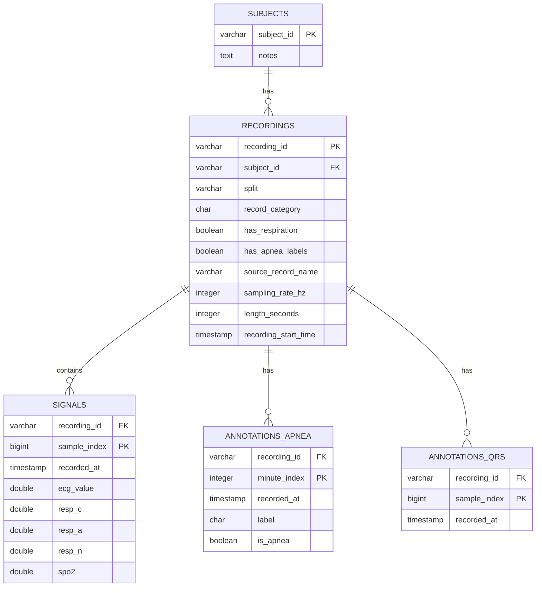

# Architecture Sprint 1 — Data Ingestion & Dual-Database Modeling

**Project:** Medical Time-Series Dataset Curation  
**Topic:** M4 — Respiratory Apnea Detection  
**Dataset:** PhysioNet Apnea-ECG Database  
**Sprint:** Sprint 1 — Data Ingestion & Architectural Modeling  
**Database Systems Compared:** PostgreSQL and TimescaleDB  

---

## 1. Objective of Sprint 1

The objective of Sprint 1 is to acquire the raw physiological dataset and design a dual-database architecture that allows the same medical time-series data to be stored and benchmarked in two different systems:

1. A traditional relational database using **PostgreSQL**.
2. A time-series optimized database using **TimescaleDB**.

The goal is not yet to train the apnea detection model. The goal of this sprint is to prepare a clean and reproducible foundation for later data wrangling, benchmarking, and model integration.

The main Sprint 1 outputs are:

- A raw data landing zone containing the original PhysioNet files.
- A normalized relational schema for PostgreSQL.
- A time-series optimized schema for TimescaleDB.
- A metadata generation strategy.
- An ingestion and ETL strategy.
- A benchmarking protocol for Sprint 2.
- Clear documentation of dataset structure, design decisions, and limitations.

---

## 2. Dataset Overview

The selected dataset is the **PhysioNet Apnea-ECG Database**, assigned for Topic M4: Respiratory Apnea Detection.

The database contains long-duration physiological recordings used for sleep apnea analysis. Each recording contains a continuous ECG signal, apnea annotations, and QRS annotations. A small subset of the recordings also contains additional respiratory and oxygen saturation signals.

### 2.1 Dataset Composition

The dataset contains **70 records** divided into two groups:

| Set | Records | Description |
|---|---:|---|
| Learning set | 35 | Records `a01`–`a20`, `b01`–`b05`, and `c01`–`c10` |
| Test set | 35 | Records `x01`–`x35` |

Each recording lasts from slightly less than 7 hours to nearly 10 hours. The ECG signal is sampled at **100 Hz**, meaning each record contains 100 ECG samples per second.

The learning records include apnea annotations. The test records do not include public apnea labels, so they can be used for unlabeled ingestion and benchmarking, but not for supervised training unless labels are provided separately.

### 2.2 Available Signals

All 70 records contain ECG data.

Only 8 records contain additional respiratory and oxygen saturation signals:

```text
a01, a02, a03, a04, b01, c01, c02, c03
```

For these records, the additional signals are:

| Signal | Description |
|---|---|
| `Resp C` | Chest respiratory effort |
| `Resp A` | Abdominal respiratory effort |
| `Resp N` | Oronasal airflow |
| `SpO2` | Oxygen saturation |

This creates an important modeling challenge: the dataset is not uniformly multimodal. Most records are ECG-only, while only a small subset contains respiration and oxygen saturation data.

---

## 3. PhysioNet File Organization

PhysioNet stores each record using several different file types. These files separate raw signal data, signal metadata, expert annotations, machine-generated annotations, and visualization shortcuts.

For example, record `a01` is one of the special records that contains both ECG and respiration data. It therefore appears in three related groups:

1. `a01.*` — ECG-only files.
2. `a01r.*` — respiration-only files.
3. `a01er.*` — combined ECG + respiration view.

### 3.1 ECG Files: `a01.*`

| File | Role |
|---|---|
| `a01.dat` | Raw binary ECG signal file |
| `a01.hea` | Header file describing how to read the ECG signal |
| `a01.apn` | Expert apnea annotations, one label per minute |
| `a01.qrs` | Machine-generated QRS/heartbeat annotations |
| `a01.xws` | WAVE visualization shortcut; not required for our pipeline |

The `.dat` file contains the raw signal values. The `.hea` file contains metadata such as the number of signals, sampling frequency, number of samples, calibration information, and signal names. The `.apn` file contains the ground-truth apnea labels for learning records. The `.qrs` file contains machine-generated heartbeat locations.

### 3.2 Respiration Files: `a01r.*`

| File | Role |
|---|---|
| `a01r.dat` | Raw binary respiration and SpO2 signal file |
| `a01r.hea` | Header file for the respiration signals |
| `a01r.apn` | Apnea annotations mapped to the respiration-only record |

The `r` suffix indicates respiration. These files contain the four additional signals: `Resp C`, `Resp A`, `Resp N`, and `SpO2`.

### 3.3 Combined Files: `a01er.*`

| File | Role |
|---|---|
| `a01er.hea` | Combined header allowing ECG and respiration signals to be read together |
| `a01er.apn` | Apnea annotations mapped to the combined view |
| `a01er.qrs` | QRS annotations mapped to the combined view |
| `a01er.xws` | WAVE visualization shortcut for the combined view |

There is no separate `a01er.dat` file. The combined header references the existing ECG and respiration `.dat` files. In our metadata extraction strategy, when a combined header such as `a01er.hea` exists, it is preferred because it allows the complete set of synchronized signals to be described together.

---

## 4. Main Time-Series Modeling Challenges

The Apnea-ECG dataset introduces several challenges that directly influence the database design.

### 4.1 Frequency Mismatch

The ECG signal is sampled at **100 Hz**, which means:

```text
100 samples/second × 60 seconds = 6,000 samples/minute
```

However, apnea annotations are available only once per minute.

This means the database cannot store ECG samples and apnea labels as if they had the same frequency. If the apnea label were duplicated into every signal row, the same label would be repeated 6,000 times per minute, wasting storage and making label updates inefficient.

Therefore, high-frequency signal samples and low-frequency apnea annotations are stored in separate tables.

### 4.2 Sparse Modalities

All records contain ECG, but only 8 records contain respiration and SpO2 signals. The schema must support both ECG-only records and multimodal records.

The chosen strategy is to use a single wide `signals` table with nullable columns for the optional modalities:

- `ecg_value`
- `resp_c`
- `resp_a`
- `resp_n`
- `spo2`

For ECG-only records, the respiratory and SpO2 columns are set to `NULL`.

This is a controlled denormalization of the high-frequency signal table. The metadata and annotations remain normalized, while the signal table is intentionally kept wide to simplify ingestion, querying, and fair benchmarking between PostgreSQL and TimescaleDB.

### 4.3 Large Data Volume

Because the ECG signal is sampled at 100 Hz and each recording lasts several hours, the final signal table is expected to contain a very large number of rows.

A rough estimate is:

```text
70 records × 8 hours × 60 minutes × 60 seconds × 100 Hz
≈ 201,600,000 signal rows
```

The exact number depends on the real duration of each record. The final value is generated by parsing the `.hea` files and summing the number of samples across all selected base records.

This large data volume is the main reason for comparing PostgreSQL with TimescaleDB.

### 4.4 No Real Calendar Timestamps

The dataset does not provide real-world recording dates such as `2023-10-25 14:00:00`. Instead, time is represented through sample indices and annotation positions.

To support SQL time-range queries and TimescaleDB hypertables, artificial timestamps are created using a fixed baseline:

```text
2000-01-01 00:00:00
```

For every signal sample:

```text
recorded_at = recording_start_time + sample_index / sampling_rate_hz
```

Since the sampling rate is 100 Hz, consecutive samples are separated by 10 milliseconds.

Example:

| sample_index | recorded_at |
|---:|---|
| 0 | `2000-01-01 00:00:00.000` |
| 1 | `2000-01-01 00:00:00.010` |
| 2 | `2000-01-01 00:00:00.020` |
| 100 | `2000-01-01 00:00:01.000` |

The original `sample_index` is always preserved for traceability to the WFDB raw files.

### 4.5 Annotation Reliability

The apnea annotations are expert-derived and represent the main ground truth for supervised apnea detection.

The QRS annotations, however, are machine-generated and unaudited. They may contain detection errors. For this reason, they are stored separately from the expert apnea annotations and are used mainly for feature extraction and benchmarking, not as direct ground truth for apnea.

---

## 5. Repository and Data Organization

The repository is organized to separate raw data, metadata, database schemas, documentation, and scripts.

Recommended structure:

```text
apnea-detection/
├── data/
│   ├── raw/
│   │   └── .gitkeep
│   └── metadata/
│       └── dataset_baseline.json
├── database/
│   ├── postgresql/
│   │   └── init/
│   │       └── 01_schema.sql
│   └── timeseries/
│       └── init/
│           └── 01_schema.sql
├── docs/
│   ├── architecture_sprint1.md
│   ├── benchmark_protocol.md
│   └── erd.md or erd.png
├── scripts/
│   ├── organize_dataset.py
│   └── generate_metadata.py
├── docker-compose.yml
├── requirements.txt
├── .env.example
├── .gitignore
└── README.md
```

### 5.1 Raw Data Landing Zone

The directory `data/raw/` is used as the local landing zone for the original PhysioNet files. These files are not modified by the database pipeline.

Raw data files should not be committed to Git because they are large. Instead, the repository should include instructions for downloading them reproducibly.

### 5.2 Metadata Directory

The directory `data/metadata/` stores generated metadata files such as:

```text
data/metadata/dataset_baseline.json
```

This file documents the source, sampling rate, duration, available signals, annotation availability, license, and selected header file for each record.

---

## 6. Data Acquisition Strategy

The dataset is downloaded directly from PhysioNet using `wget`:

```bash
wget -r -N -c -np https://physionet.org/files/apnea-ecg/1.0.0/
```

This creates a nested directory similar to:

```text
physionet.org/files/apnea-ecg/1.0.0/
```

After downloading, the organization script moves valid dataset files into `data/raw/`:

```bash
python scripts/organize_dataset.py
```

The script searches for the downloaded PhysioNet folder, moves expected file types into `data/raw/`, skips unexpected files, and removes the temporary `physionet.org/` directory after the move is complete.

Expected file extensions include:

```text
.dat, .hea, .apn, .qrs, .xws, .txt
```

After organization, the metadata generation script is executed:

```bash
python scripts/generate_metadata.py
```

This produces:

```text
data/metadata/dataset_baseline.json
```

---

## 7. Baseline Metadata Generation

The baseline metadata file is generated from the WFDB `.hea` files.

For each base record such as `a01`, `b01`, `c01`, or `x01`, the metadata script:

1. Detects the base `.hea` files.
2. Checks whether a combined ECG + respiration header exists.
3. Uses `<record>er.hea` when available.
4. Falls back to `<record>.hea` otherwise.
5. Extracts sampling rate, number of samples, and signal names.
6. Detects whether respiration signals exist.
7. Detects whether apnea annotations exist.
8. Detects whether QRS annotations exist.
9. Assigns the correct learning/test split.
10. Stores source, DOI, and license information.

### 7.1 Metadata Fields

Each record in `dataset_baseline.json` contains fields such as:

| Field | Description |
|---|---|
| `record_name` | Original PhysioNet record name, for example `a01` |
| `subject_id` | Internal subject identifier |
| `source_record_name` | Original record name used for traceability |
| `split` | `learning` or `test` |
| `category` | `a`, `b`, `c`, or `x` |
| `sampling_rate_hz` | Signal sampling frequency |
| `num_samples` | Number of signal samples |
| `length_seconds` | Approximate duration of the recording |
| `signals` | List of signal names detected from the header |
| `has_respiration` | Whether respiratory/SpO2 signals are available |
| `has_apnea_annotations` | Whether `.apn` annotations exist |
| `has_qrs_annotations` | Whether `.qrs` annotations exist |
| `selected_header_file` | Header file selected for parsing |
| `artificial_start_time` | Synthetic timestamp baseline |
| `source` | Dataset source |
| `source_url` | Public dataset URL |
| `doi` | Dataset DOI |
| `license` | Dataset license |

### 7.2 Subject Mapping

Most records are treated as one subject per recording.

However, records `c05` and `c06` are known to originate from the same original recording. To preserve this relationship, both are mapped to the same subject identifier:

```text
subject_c05_c06
```

All other records are mapped as:

```text
subject_<record_name>
```

Example:

```text
a01 → subject_a01
b03 → subject_b03
x12 → subject_x12
```

---

## 8. PostgreSQL Relational Architecture

PostgreSQL is used as the standard relational baseline. The schema is designed to preserve data integrity, avoid unnecessary duplication, and provide a fair comparison against TimescaleDB.

### 8.1 Main Tables

The PostgreSQL schema contains five main tables:

| Table | Purpose |
|---|---|
| `subjects` | Stores patient/subject-level metadata |
| `recordings` | Stores recording-level metadata |
| `signals` | Stores high-frequency ECG and optional respiration/SpO2 samples |
| `annotations_apnea` | Stores expert minute-level apnea labels |
| `annotations_qrs` | Stores machine-generated QRS/heartbeat locations |

### 8.2 Entity Relationships

The relational structure follows this hierarchy:

```text
subjects
   └── recordings
          ├── signals
          ├── annotations_apnea
          └── annotations_qrs
```

Each subject can have one or more recordings. Each recording can have many signal samples, many apnea annotations, and many QRS annotations.

### 8.3 `subjects` Table

The `subjects` table represents the individual patient or subject.

```sql
CREATE TABLE subjects (
    subject_id VARCHAR(20) PRIMARY KEY,
    notes TEXT
);
```

This table allows multiple recordings to be linked to the same subject when needed, especially for the `c05` and `c06` special case.

### 8.4 `recordings` Table

The `recordings` table stores one row per recording session.

Important fields include:

| Field | Description |
|---|---|
| `recording_id` | Original record identifier, for example `a01` |
| `subject_id` | Foreign key to `subjects` |
| `split` | `learning` or `test` |
| `record_category` | `a`, `b`, `c`, or `x` |
| `has_respiration` | Whether extra respiratory/SpO2 signals exist |
| `has_apnea_labels` | Whether apnea labels are available |
| `source_record_name` | Original PhysioNet record name |
| `sampling_rate_hz` | Usually 100 Hz |
| `length_seconds` | Duration of the recording |
| `recording_start_time` | Artificial baseline timestamp |

Check constraints are used to ensure valid split values, valid record categories, positive sampling rates, and positive recording lengths.

### 8.5 `signals` Table

The `signals` table stores high-frequency physiological samples.

It contains:

| Field | Description |
|---|---|
| `recording_id` | Foreign key to `recordings` |
| `sample_index` | Original sample position in the recording |
| `recorded_at` | Artificial timestamp |
| `ecg_value` | ECG signal value |
| `resp_c` | Chest respiratory effort |
| `resp_a` | Abdominal respiratory effort |
| `resp_n` | Oronasal airflow |
| `spo2` | Oxygen saturation |

The primary key is:

```sql
PRIMARY KEY (recording_id, sample_index)
```

This key reflects the raw signal structure because each sample is naturally identified by its recording and its sample position.

A unique constraint is also added:

```sql
UNIQUE (recording_id, recorded_at)
```

This prevents duplicate timestamps within the same recording and supports efficient time-range queries.

### 8.6 `annotations_apnea` Table

The `annotations_apnea` table stores expert apnea labels.

Each row corresponds to one minute of a recording.

Important fields include:

| Field | Description |
|---|---|
| `recording_id` | Foreign key to `recordings` |
| `minute_index` | Minute number inside the recording |
| `recorded_at` | Timestamp for the start of the labeled minute |
| `label` | Original label, usually `A` or `N` |
| `is_apnea` | Boolean label for easier SQL and ML usage |

The primary key is:

```sql
PRIMARY KEY (recording_id, minute_index)
```

The label is constrained to:

```sql
CHECK (label IN ('A', 'N'))
```

### 8.7 `annotations_qrs` Table

The `annotations_qrs` table stores machine-generated QRS locations.

Each row corresponds to one detected heartbeat.

Important fields include:

| Field | Description |
|---|---|
| `recording_id` | Foreign key to `recordings` |
| `sample_index` | Sample position of the detected QRS complex |
| `recorded_at` | Artificial timestamp of the heartbeat |

The primary key is:

```sql
PRIMARY KEY (recording_id, sample_index)
```

QRS annotations are stored separately because they are machine-generated and may contain errors.

### 8.8 PostgreSQL Indexing Strategy

Primary keys and unique constraints automatically create B-tree indexes.

Additional indexes support common benchmark queries:

```sql
CREATE INDEX idx_recordings_subject
ON recordings(subject_id);

CREATE INDEX idx_apnea_events
ON annotations_apnea(recording_id, is_apnea, recorded_at);

CREATE INDEX idx_signals_time
ON signals(recorded_at);

CREATE INDEX idx_apnea_time
ON annotations_apnea(recorded_at);

CREATE INDEX idx_qrs_time
ON annotations_qrs(recorded_at);
```

These indexes are designed to support:

- Listing all recordings for a subject.
- Filtering apnea events.
- Time-range scans over signals.
- Time-range scans over apnea annotations.
- Time-range scans over QRS annotations.

---

## 9. TimescaleDB Time-Series Architecture

TimescaleDB is selected as the secondary time-series optimized database.

TimescaleDB is built on PostgreSQL but adds time-series features such as hypertables, automatic time-based chunking, time-aware query optimization, native downsampling functions, and compression.

This makes it suitable for medical monitoring workloads where most queries are based on:

- A specific recording or subject.
- A time interval.
- Aggregation over time windows.
- Large high-frequency signal tables.

### 9.1 Why TimescaleDB Was Chosen

TimescaleDB was chosen because it allows the project to keep a PostgreSQL-compatible relational model while adding time-series optimizations.

This is important because the comparison remains fair:

- PostgreSQL and TimescaleDB use the same logical entities.
- Both systems store the same transformed data.
- SQL syntax remains mostly similar.
- The benchmark compares storage architecture rather than completely different data models.

### 9.2 Main Difference from PostgreSQL

The logical schema is similar to PostgreSQL, but the high-frequency and event tables are converted into hypertables.

The TimescaleDB hypertables are:

| Table | Reason |
|---|---|
| `signals` | Main high-frequency signal table |
| `annotations_apnea` | Minute-level time annotations |
| `annotations_qrs` | Event-based heartbeat annotations |

The metadata tables `subjects` and `recordings` remain normal relational tables because they are not high-frequency time-series data.

### 9.3 Timestamp Type

The TimescaleDB schema uses `TIMESTAMPTZ` instead of `TIMESTAMP`.

The artificial start time is:

```sql
TIMESTAMPTZ '2000-01-01 00:00:00+00'
```

This keeps timestamps timezone-aware and avoids ambiguity when using time-series functions.

### 9.4 TimescaleDB Primary Key Strategy

In PostgreSQL, the `signals` table uses:

```sql
PRIMARY KEY (recording_id, sample_index)
```

In TimescaleDB, the `signals` table uses:

```sql
PRIMARY KEY (recording_id, recorded_at)
```

This is necessary because hypertable primary keys and unique constraints must include the time partition column. Since `recorded_at` is the hypertable time column, it must be part of the primary key.

The `sample_index` is still stored in the table to preserve traceability to the original raw WFDB files.

### 9.5 Hypertable Creation

The `signals` table is converted into a hypertable using:

```sql
SELECT create_hypertable(
    'signals',
    'recorded_at',
    chunk_time_interval => INTERVAL '1 hour',
    if_not_exists => TRUE
);
```

The apnea and QRS annotation tables are also converted into hypertables:

```sql
SELECT create_hypertable(
    'annotations_apnea',
    'recorded_at',
    chunk_time_interval => INTERVAL '1 day',
    if_not_exists => TRUE
);

SELECT create_hypertable(
    'annotations_qrs',
    'recorded_at',
    chunk_time_interval => INTERVAL '1 day',
    if_not_exists => TRUE
);
```

### 9.6 Chunk Interval Choice

The `signals` hypertable uses a 1-hour chunk interval.

This choice is important because the dataset uses artificial timestamps. If every recording starts near the same baseline timestamp, a very large chunk interval such as 1 day could place too much data into the same time chunk. A 1-hour chunk interval creates smaller partitions and makes range queries more meaningful for benchmarking.

For apnea and QRS annotation tables, 1-day chunks are acceptable because these tables are much smaller than the `signals` table.

### 9.7 Compression Strategy

TimescaleDB compression is enabled on the `signals` hypertable.

```sql
ALTER TABLE signals SET (
    timescaledb.compress,
    timescaledb.compress_segmentby = 'recording_id',
    timescaledb.compress_orderby = 'recorded_at DESC'
);
```

The compression configuration uses:

| Option | Value | Reason |
|---|---|---|
| `compress_segmentby` | `recording_id` | Most queries filter by one recording |
| `compress_orderby` | `recorded_at DESC` | Time-range scans are the main workload |

The compression policy itself should be applied after data loading in Sprint 2.

Example:

```sql
SELECT add_compression_policy('signals', INTERVAL '1 day');
```

The actual compression ratio will be measured during Sprint 2.

### 9.8 TimescaleDB Indexing Strategy

The TimescaleDB schema keeps similar indexes to the PostgreSQL version:

```sql
CREATE INDEX idx_recordings_subject
ON recordings(subject_id);

CREATE INDEX idx_apnea_events
ON annotations_apnea(recording_id, is_apnea, recorded_at DESC);

CREATE INDEX idx_signals_time
ON signals(recorded_at DESC);

CREATE INDEX idx_apnea_time
ON annotations_apnea(recorded_at DESC);

CREATE INDEX idx_qrs_time
ON annotations_qrs(recorded_at DESC);
```

These indexes help with filtering by recording, apnea status, and time range.

---

## 10. Entity-Relationship Model

The ERD follows a simple normalized hierarchy.



For the TimescaleDB version, the same logical ERD applies. The main difference is that `signals`, `annotations_apnea`, and `annotations_qrs` are implemented as hypertables, and their primary keys include the `recorded_at` time column.

---

## 11. ETL and Ingestion Strategy

The ingestion pipeline follows an ETL approach:

```text
Extract → Transform → Load
```

The objective is to convert raw WFDB files into structured rows that can be loaded into both PostgreSQL and TimescaleDB.

### 11.1 Extraction

The raw PhysioNet files are parsed using the Python `wfdb` library.

Signal data is extracted using:

```python
wfdb.rdrecord(record_name)
```

Apnea annotations are extracted using:

```python
wfdb.rdann(record_name, "apn")
```

QRS annotations are extracted using:

```python
wfdb.rdann(record_name, "qrs")
```

For records with combined ECG + respiration headers, the pipeline should prefer the combined record name, such as `a01er`, to load synchronized ECG and respiration signals together.

For ECG-only records, the base record name, such as `a05`, is used.

### 11.2 Metadata Loading

Before inserting signal samples, metadata is inserted into:

1. `subjects`
2. `recordings`

This ensures foreign key constraints are satisfied before loading signals and annotations.

Each recording is assigned:

| Field | Source |
|---|---|
| `recording_id` | Base record name |
| `subject_id` | Generated metadata mapping |
| `split` | Derived from record category |
| `record_category` | First character of record name |
| `has_respiration` | Detected from signal names |
| `has_apnea_labels` | Detected from `.apn` files |
| `sampling_rate_hz` | Parsed from `.hea` |
| `length_seconds` | Computed from samples / sampling rate |
| `recording_start_time` | Artificial baseline |

### 11.3 Signal Transformation

For each record, the raw signal matrix is transformed into rows with the following structure:

```text
recording_id, sample_index, recorded_at, ecg_value, resp_c, resp_a, resp_n, spo2
```

For ECG-only records, the optional fields are set to `NULL`:

```text
resp_c = NULL
resp_a = NULL
resp_n = NULL
spo2 = NULL
```

For multimodal records, the values are filled from the combined ECG + respiration header.

### 11.4 Timestamp Synthesis

For each signal sample:

```text
recorded_at = recording_start_time + sample_index / sampling_rate_hz
```

At 100 Hz:

```text
sample interval = 0.01 seconds = 10 milliseconds
```

For apnea annotations:

```text
recorded_at = recording_start_time + minute_index × 60 seconds
```

For QRS annotations:

```text
recorded_at = recording_start_time + qrs_sample_index / sampling_rate_hz
```

### 11.5 Apnea Annotation Transformation

Each apnea annotation is transformed into:

```text
recording_id, minute_index, recorded_at, label, is_apnea
```

The label mapping is:

| Original label | Meaning | Boolean value |
|---|---|---|
| `A` | Apnea | `TRUE` |
| `N` | Normal | `FALSE` |

Test records do not have public apnea annotations, so no rows are inserted into `annotations_apnea` for those records.

### 11.6 QRS Annotation Transformation

Each QRS annotation is transformed into:

```text
recording_id, sample_index, recorded_at
```

The QRS annotations are useful for heart-rate feature extraction, but they are not treated as expert-validated labels.

### 11.7 Loading Order

To preserve foreign key integrity, rows are inserted in the following order:

```text
1. subjects
2. recordings
3. signals
4. annotations_apnea
5. annotations_qrs
```

### 11.8 Batch Insertion Strategy

Because the dataset may contain hundreds of millions of signal rows, row-by-row insertion is not efficient.

The pipeline should insert data in batches, for example:

```text
100,000 rows per batch
```

Possible loading methods:

- `psycopg2.extras.execute_values()`
- PostgreSQL `COPY`

The same transformed batches are inserted into both PostgreSQL and TimescaleDB. This ensures that the Sprint 2 comparison is fair.

---

## 12. Docker-Based Database Environment

The project uses Docker Compose to run both database systems locally.

### 12.1 PostgreSQL Service

The PostgreSQL service uses:

```yaml
image: postgres:17-alpine
container_name: apnea_postgres
```

It exposes PostgreSQL on port `5432` by default and loads initialization SQL scripts from:

```text
./database/postgresql/init
```

### 12.2 TimescaleDB Service

The TimescaleDB service uses:

```yaml
image: timescale/timescaledb:2.17.2-pg17
container_name: apnea_timescaledb
```

It exposes TimescaleDB on port `5433` by default and loads initialization SQL scripts from:

```text
./database/timeseries/init
```

### 12.3 Environment Variables

A `.env.example` file should be included:

```env
POSTGRES_USER=user
POSTGRES_PASSWORD=password
POSTGRES_DB=apnea_db
POSTGRES_PORT=5432

TIMESCALE_USER=timescale_user
TIMESCALE_PASSWORD=timescale_password
TIMESCALE_DB=apnea_ts_db
TIMESCALE_PORT=5433
```

The databases can be started using:

```bash
docker compose up -d
```

---

## 13. Benchmarking Protocol for Sprint 2

Sprint 2 will compare PostgreSQL and TimescaleDB using the same transformed dataset and equivalent SQL queries.

The goal is to measure practical differences in:

- Ingestion speed.
- Range query latency.
- Aggregation performance.
- Signal-label join performance.
- Storage footprint.
- Compression efficiency.

The benchmark results will be measured empirically. No final performance conclusion is made in Sprint 1.

### 13.1 Test 1 — Write Throughput

This test measures how long it takes to insert the dataset into each database.

Metrics:

| Metric | Description |
|---|---|
| Total ingestion time | Time required to load all rows |
| Rows inserted per second | Total rows / ingestion time |
| Signal ingestion time | Time for `signals` table |
| Annotation ingestion time | Time for apnea and QRS annotations |

Expected output:

```text
rows_per_second = total_inserted_rows / total_ingestion_time_seconds
```

### 13.2 Test 2 — One-Hour Range Query

This query simulates retrieving one hour of ECG for a specific recording.

```sql
SELECT recorded_at, ecg_value
FROM signals
WHERE recording_id = 'a01'
  AND recorded_at >= '2000-01-01 01:00:00'
  AND recorded_at <  '2000-01-01 02:00:00'
ORDER BY recorded_at;
```

For TimescaleDB, timestamps use timezone-aware syntax:

```sql
SELECT recorded_at, ecg_value
FROM signals
WHERE recording_id = 'a01'
  AND recorded_at >= '2000-01-01 01:00:00+00'
  AND recorded_at <  '2000-01-01 02:00:00+00'
ORDER BY recorded_at;
```

Metrics:

- Average latency over multiple runs.
- Minimum latency.
- Maximum latency.
- Standard deviation.

### 13.3 Test 3 — ECG Temporal Aggregation

This query calculates one-minute ECG statistics for a full recording.

PostgreSQL:

```sql
SELECT DATE_TRUNC('minute', recorded_at) AS minute_bucket,
       AVG(ecg_value) AS avg_ecg,
       MIN(ecg_value) AS min_ecg,
       MAX(ecg_value) AS max_ecg
FROM signals
WHERE recording_id = 'a01'
GROUP BY DATE_TRUNC('minute', recorded_at)
ORDER BY minute_bucket;
```

TimescaleDB:

```sql
SELECT time_bucket('1 minute', recorded_at) AS minute_bucket,
       AVG(ecg_value) AS avg_ecg,
       MIN(ecg_value) AS min_ecg,
       MAX(ecg_value) AS max_ecg
FROM signals
WHERE recording_id = 'a01'
GROUP BY minute_bucket
ORDER BY minute_bucket;
```

This benchmark is important because downsampling is common in medical time-series preprocessing.

### 13.4 Test 4 — QRS-Based Heart Rate Aggregation

This query estimates heartbeats per minute from QRS annotations.

PostgreSQL:

```sql
SELECT DATE_TRUNC('minute', recorded_at) AS minute_bucket,
       COUNT(*) AS beats_per_minute
FROM annotations_qrs
WHERE recording_id = 'a01'
GROUP BY DATE_TRUNC('minute', recorded_at)
ORDER BY minute_bucket;
```

TimescaleDB:

```sql
SELECT time_bucket('1 minute', recorded_at) AS minute_bucket,
       COUNT(*) AS beats_per_minute
FROM annotations_qrs
WHERE recording_id = 'a01'
GROUP BY minute_bucket
ORDER BY minute_bucket;
```

This test evaluates event-based aggregation performance.

### 13.5 Test 5 — Signal-to-Label Join

This query joins high-frequency ECG samples with minute-level apnea annotations.

```sql
SELECT s.recording_id,
       a.minute_index,
       a.label,
       a.is_apnea,
       COUNT(*) AS signal_samples,
       AVG(s.ecg_value) AS avg_ecg
FROM annotations_apnea a
JOIN signals s
  ON s.recording_id = a.recording_id
 AND s.recorded_at >= a.recorded_at
 AND s.recorded_at <  a.recorded_at + INTERVAL '1 minute'
WHERE a.recording_id = 'a01'
GROUP BY s.recording_id, a.minute_index, a.label, a.is_apnea
ORDER BY a.minute_index;
```

This test is important because model training requires linking signal windows to apnea labels.

### 13.6 Test 6 — Storage Footprint and Compression

The physical size of the `signals` table is measured in both systems.

```sql
SELECT pg_size_pretty(pg_total_relation_size('signals')) AS total_size;
```

For TimescaleDB, compression is then applied and the size is measured again.

The compression ratio is calculated as:

```text
compression_ratio = size_before_compression / size_after_compression
```

### 13.7 Expected Benchmark Result Table

Sprint 2 results will be summarized as follows:

| Metric | PostgreSQL | TimescaleDB |
|---|---:|---:|
| Signal ingestion time | To be measured | To be measured |
| Rows inserted per second | To be measured | To be measured |
| 1-hour range query latency | To be measured | To be measured |
| 1-minute ECG aggregation latency | To be measured | To be measured |
| QRS heart-rate aggregation latency | To be measured | To be measured |
| Signal-label join latency | To be measured | To be measured |
| Storage size before compression | To be measured | To be measured |
| Storage size after compression | Not applicable | To be measured |
| Compression ratio | Not applicable | To be measured |

---

## 14. Design Decisions Summary

### 14.1 Separation of Metadata, Signals, and Annotations

Metadata, high-frequency signals, apnea labels, and QRS events are stored in separate tables.

This avoids mixing data with different frequencies and prevents duplication of minute-level labels across thousands of signal rows.

### 14.2 Wide Signal Table with Nullable Modalities

The `signals` table contains columns for ECG, respiration, and SpO2.

This is chosen because:

- All records contain ECG.
- Only 8 records contain respiratory and SpO2 signals.
- A single table simplifies ingestion and benchmarking.
- Missing modalities can be represented cleanly using `NULL`.

This design is not fully normalized at the signal-channel level, but it is intentional and practical for this benchmark.

### 14.3 Artificial Timestamp Baseline

Artificial timestamps are necessary because the dataset does not provide real calendar timestamps.

The fixed baseline is:

```text
2000-01-01 00:00:00
```

This allows SQL time-window queries and TimescaleDB hypertables while preserving original sample indices.

### 14.4 Composite Keys Instead of Surrogate Keys

The schema avoids using a surrogate `BIGSERIAL` ID for signal samples.

In PostgreSQL:

```sql
PRIMARY KEY (recording_id, sample_index)
```

In TimescaleDB:

```sql
PRIMARY KEY (recording_id, recorded_at)
```

This keeps the sample identity meaningful and avoids unnecessary artificial row IDs in the largest table.

### 14.5 Same Logical Schema for Fair Comparison

PostgreSQL and TimescaleDB use the same logical entities and transformed data.

This makes the comparison fair because the benchmark focuses on the effect of time-series optimization rather than differences in the data model.

---

## 15. Known Limitations

### 15.1 Missing Apnea Labels for Test Records

The `x01`–`x35` test records do not include public `.apn` labels.

They can still be used for ingestion and query benchmarking, but supervised model training should rely on learning records unless additional labels are available.

### 15.2 Sparse Respiration Signals

Only 8 records contain respiratory and SpO2 signals. This limits the ability to train a fully multimodal model across the entire dataset.

The schema handles this by inserting `NULL` for missing modalities.

### 15.3 Synthetic Timestamps

The timestamps in the database are artificial and do not represent real recording dates.

They are used only for time-series indexing, querying, and benchmarking.

The original `sample_index` is preserved for scientific traceability.

### 15.4 QRS Annotation Errors

QRS annotations are machine-generated and unaudited. They may contain errors.

They are useful for heart-rate features and benchmarking, but should not be treated as expert-verified labels.

### 15.5 Wide Signal Table Trade-Off

The wide signal table simplifies benchmarking and data loading but is not the most flexible schema for arbitrary new signal types.

If the project later needs to support many more sensor types, a more normalized design using a separate `signal_channels` table and long-format signal values may be considered.

---

## 16. Ethical and Reproducibility Considerations

The dataset is publicly available and ethically reusable through PhysioNet. The project preserves the original raw files and does not overwrite or modify them.

Reproducibility is supported through:

- Keeping raw files in `data/raw/`.
- Generating metadata automatically from `.hea` files.
- Preserving `sample_index` values.
- Storing original record names.
- Documenting artificial timestamp generation.
- Using Docker Compose for database setup.
- Keeping PostgreSQL and TimescaleDB schemas under version control.

The dataset should be cited using its official PhysioNet source, DOI, and license information in the final report.

---

## 17. Sprint 1 Deliverables Status

| Deliverable | Status | Notes |
|---|---|---|
| Raw data landing zone | Prepared | `data/raw/` stores original PhysioNet files locally |
| PostgreSQL schema | Prepared | Normalized metadata and annotation tables with wide signal table |
| TimescaleDB schema | Prepared | Hypertables, chunking, and compression configuration included |
| Ingestion strategy | Prepared | WFDB parsing, timestamp synthesis, missing modality handling, batch insertion |
| Benchmarking protocol | Prepared | Write, range, aggregation, join, and storage tests defined |
| Baseline metadata file | Prepared by script | Generated using `scripts/generate_metadata.py` |
| ERD | To include | Mermaid ERD included in this document; can also be exported as image |
| Architecture document | Prepared | This document |

---

## 18. Conclusion

Sprint 1 establishes the architectural foundation for the respiratory apnea detection benchmark.

The project uses the PhysioNet Apnea-ECG dataset and addresses its main challenges: high-frequency ECG samples, minute-level apnea annotations, sparse respiration modalities, missing test labels, QRS annotation uncertainty, and absence of real timestamps.

The PostgreSQL schema provides a clean relational baseline with separate tables for subjects, recordings, signals, apnea annotations, and QRS annotations. The TimescaleDB schema keeps the same logical structure but converts the time-dependent tables into hypertables and enables compression for the high-frequency signal table.

The ingestion strategy ensures that raw WFDB files can be transformed into equivalent rows for both database systems. The benchmarking protocol defines the exact read, write, aggregation, join, and storage tests that will be executed during Sprint 2.

The final result of Sprint 1 is a reproducible and well-documented architecture that prepares the project for large-scale ingestion, performance benchmarking, and later integration with an attention-based anomaly detection model.

